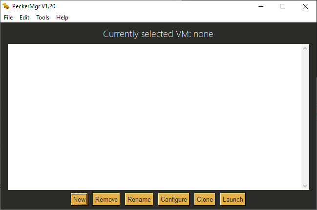

# PeckerMgr, made for Microsoft Windows.
PeckerMgr is a simplistic Python application made for creating and running QEMU virtual machines, made by Quevidia!

It is very easy to get this application up and going for the first time. You will get a few prompts relating to setting up PeckerMgr, requiring little proper attention, and you should be good to go with the base configuration.

Everything related to how to use PeckerMgr will be mentioned in the tour process, which is not only automatically ran upon first startup, but can also be ran via <code>Help > Tour</code>.

## Branches

<code>master</code> - Main branch containing the source code for recent stable releases of PeckerMgr

<code>developer</code> - Developer branch containing the source code for recent developer releases of PeckerMgr

## Reminders

Keep in mind that this application makes use of PySimpleGUI, which is not installed by default alongside Python. To install PySimpleGUI, you'll want to use <code>pip</code>. Essentially, open up a command prompt window, locate <code>pip</code> (unless it is specified in an environmental variable) and type in <code>pip install pysimplegui</code>. Ensure that you're using an up-to-date version of Python. To double-check the earliest version of Python that PySimpleGUI supports, you'll want to check out their documentation.

Only stable releases of PeckerMgr are uploaded in compiled binary to the <code>tags</code> section of this repository. Should you want to run the most recent developer release of PeckerMgr, you'll want to download the source code for this application.

## Building an executable

Although not necessary if you have Python installed, you may build an executable for PeckerMgr with an application called PyInstaller. PyInstaller essentially bundles a Python application including the necessary dependencies into a single package, which allows you to also use PeckerMgr without any Python interpreter installed on your system. Building an executable with PyInstaller is as simple as running <code>pyinstaller --onefile Directory\To\PeckerMgr.py -w</code> in a command prompt - no elevated permissions required. The specified flags (--onefile and -w) are optional, however I would say that they are preferable in this case, since --onefile will get PyInstaller to only output the executable with everything packed inside it, and -w will specify PyInstaller to build an executable *without* the console. If you managed to get a successful build of PeckerMgr, feel free to also change its icon with <code>Icons\PeckerMgr1.ico</code>!

## For advanced users only

### Are you wanting to specify a custom QEMU configuration?
Assuming that anything mandatory is inside your QEMU directory, you may feel free to specify the configuration necessary for any modified QEMU applications compiled for Microsoft Windows. Just ensure that you read everything mentioned in <code>Machines > README.txt</code> before tinkering with your custom QEMU configurations.

### Are you looking to specifying a parameter for your QEMU virtual machine, but can't find the option for it?
If you are configuring your virtual machine, you should notice the miscellaneous tab. This tab contains an option for those who would like to specify certain parameters for their virtual machines, such as a paramater for creating a specific NVRAM file. Do ensure that you check both the tour and the <code>Need help?</code> option.

If you have any suggestions or issues, do let me know. And most importantly, enjoy!
